# sqlite-inspector

A read-only C# CLI that parses SQLite `.db` files natively — no SQLite library, no abstraction.

Built stage by stage to understand how SQLite works: file format, B-trees, varints, indexes.

---

## Table of Contents
- [Commands](#commands)
- [Stack](#stack)
- [Architecture](#architecture)
- [Setup](#setup)
    - [Create a test database](#create-a-test-database)
    - [Inspect the raw file](#inspect-the-raw-file)
- [Concepts](#concepts)
    - [Big-endian vs little-endian](#big-endian-vs-little-endian)
    - [B-trees](#b-trees)
    - [Varints](#varints)
    - [Indexes](#indexes)
- [Stages](#stages)
    - [Stage 1 — File Header](#stage-1-—-file-header)
    - [Stage 2 — B-trees](#stage-2-—-b-trees)
- [Reference](#reference)

---

## Commands

```bash
sqlite-inspector describe sample.db
sqlite-inspector describe sample.db --page 1
sqlite-inspector query sample.db patients --where "name=Dupont"
sqlite-inspector stats sample.db patients
```

---

## Stack

- C# (.NET 8), console app
- XUnit for tests
- `BinaryReader` for all binary parsing
- No SQLite libraries

---

## Architecture

The stages are **cumulative layers**.

Each stage adds one class to a shared layer.

The commands (`describe`, `query`, `stats`) are the only real vertical slices — they compose the layers at the top.

```
sqlite-inspector/
├── src/
│   ├── Program.cs
│   ├── Result.cs
│   ├── IO/
│   │   ├── PageReader.cs
│   │   └── BinaryHelpers.cs
│   ├── Format/
│   │   ├── DbHeader.cs
│   │   ├── HeaderParser.cs
│   │   ├── PageHeader.cs
│   │   ├── PageHeaderParser.cs
│   │   └── VarintReader.cs
│   ├── BTree/
│   │   ├── BTreeWalker.cs
│   │   └── RecordDecoder.cs
│   ├── Schema/
│   │   └── SchemaReader.cs
│   └── Query/
│       ├── QueryRequest.cs
│       ├── QueryHandler.cs
│       └── QueryResponse.cs
└── tests/
    └── sqlite-inspector.Tests/
```

**Vertical slices appear at the command boundary only.**

Everything below is shared infrastructure, built layer by layer across the stages.

---

## Setup

### Create a test database

```powershell
sqlite3 .\test.db "
CREATE TABLE patients (id INTEGER PRIMARY KEY, name TEXT, dob TEXT, gender TEXT);
CREATE TABLE appointments (id INTEGER PRIMARY KEY, patient_id INTEGER, date TEXT, notes TEXT);
INSERT INTO patients VALUES (1, 'Dupont', '1982-04-12', 'M');
INSERT INTO patients VALUES (2, 'Martin', '1975-11-03', 'F');
INSERT INTO patients VALUES (3, 'Bernard', '1990-07-22', 'M');
INSERT INTO appointments VALUES (1, 1, '2024-01-15', 'Routine checkup');
INSERT INTO appointments VALUES (2, 2, '2024-01-16', 'Follow-up');
"
```

Cross-check:

```powershell
sqlite3 .\test.db "PRAGMA page_size; PRAGMA page_count; SELECT * FROM patients;"
```

```
╭───────────╮
│ page_size │
╞═══════════╡
│      4096 │
╰───────────╯
╭────────────╮
│ page_count │
╞════════════╡
│          3 │
╰────────────╯
╭────┬─────────┬────────────┬────────╮
│ id │  name   │    dob     │ gender │
╞════╪═════════╪════════════╪════════╡
│  1 │ Dupont  │ 1982-04-12 │ M      │
│  2 │ Martin  │ 1975-11-03 │ F      │
│  3 │ Bernard │ 1990-07-22 │ M      │
╰────┴─────────┴────────────┴────────╯
```

### Inspect the raw file

SQLite `.db` files are binary (machine language) — unreadable in a text editor.

Hex is the human-readable representation of binary. 

ASCII is the text interpretation of hex.

```powershell
Format-Hex .\test.db | Select-Object -First 4
```

```
       Offset Bytes                                           Ascii
              00 01 02 03 04 05 06 07 08 09 0A 0B 0C 0D 0E 0F
       ------ ----------------------------------------------- -----
000000000000  53 51 4C 69 74 65 20 66 6F 72 6D 61 74 20 33 00 SQLite format 3
000000000010  10 00 01 01 00 40 20 20 00 00 00 07 00 00 00 03 ..@     .   .
000000000020  00 00 00 00 00 00 00 00 00 00 00 02 00 00 00 04          .   .
000000000030  00 00 00 00 00 00 00 00 00 00 00 01 00 00 00 00          .
```

**Offset** — byte position from the start of the file. Each row is 16 bytes.

**Bytes** — raw hex values. Each pair is one byte. `53` = letter `S`, `10 00` = page size 4096 in big-endian.

**ASCII** — printable interpretation. Non-printable bytes show as `·`.

Row 0: `SQLite format 3` — the magic string, bytes 0–15, immediately readable.

Row 1: `10 00` at offset `0x10` — page size, big-endian for `0x1000` = 4096.

The file is structured as a 100-byte header followed by fixed-size pages:

```
0–99:        File header
100–4095:    Page 1 (root B-tree page, contains sqlite_schema)
4096–8191:   Page 2
8192–12287:  Page 3
```



---

## Concepts

Key ideas that apply across multiple stages.

### Big-endian vs little-endian

Many early Computer Science decisions were made by mathematicians.

Big-endian reflects **mathematical, human convention** — write the most significant byte first, exactly as you write a number on paper.

You write `4096`, you store `0x10`, then `0x00`.

Little-endian is **hardware, machine-oriented** — optimize for CPU efficiency by processing bytes incrementally.

You write `4096`, you store `0x00`, then `0x10`.

SQLite uses big-endian because a file format is optimized for **comparison**, not compute.

And byte-by-byte comparison (`memcmp`) produces correct numeric order when the most significant byte comes first.

`BinaryReader` reads little-endian by default (compute-first). 

`BinaryHelpers` corrects this for all multi-byte fields.

### B-trees

SQLite divides the `.db` file into fixed-size pages — every read and write operates on one page at a time.

Page 1 is always the **root B-tree page**: it holds `sqlite_schema`, the table that describes all other tables.

A B-tree is a tree data structure that keeps data sorted and allows searches, sequential access, insertions, and deletions in O(log n).

SQLite stores every table and index as a B-tree. Each node is exactly one page.

Example of B-tree structure:

```
        [ 30 ]
       /      \
   [10, 20]  [40, 50]
```

Every B-tree page starts with a page header that tells you its type and how many cells it contains.

| Offset | Size | Meaning |
|--------|------|---------|
| 0 | 1 | Page type |
| 3 | 2 | Cell count (big-endian) |
| 5 | 2 | Cell content offset (big-endian) |

Example in B-tree page header:

```
[ 0x0D ] [ 0x00 0x02 ] [ 0x00 0x28 ]
```

#### Page types

| Code | Meaning |
|------|---------|
| `0x0D` | Leaf table page — holds actual row data |
| `0x05` | Interior table page — holds child page pointers |
| `0x0A` | Leaf index page |
| `0x02` | Interior index page |

```
Interior page (navigation only)
├── child page 2 (leaf) → row data
├── child page 5 (leaf) → row data
└── child page 7 (leaf) → row data
```

**Leaf pages** hold actual row data (cells).

**Interior pages** hold keys and child page pointers — no row data, just navigation.

Row count = sum of cells across all leaf pages.

#### Why does page 1 start at byte 100?

The 100-byte database header occupies the start of page 1.

So the page header for page 1 starts at byte 100, not byte 0.

**All other pages start at byte 0 of their page.**

`PageReader` always seeks to the page start — `PageHeaderParser` handles the offset. Single responsibility.

### Varints

A varint (variable-length integer) encodes a 64-bit integer in 1–9 bytes.

Each byte contributes 7 bits of value. The high bit signals whether another byte follows:

- High bit `1` → more bytes follow
- High bit `0` → this is the last byte

Small values (< 128) fit in 1 byte. SQLite uses varints for record header lengths and serial type codes.

### Result pattern

Expected failures return `Result<T>`, not exceptions.

```csharp
Result<DbHeader> result = new HeaderParser().Parse(filePath);
if (!result.IsSuccess)
{
    Console.Error.WriteLine(result.Error);
    return 1;
}
DbHeader h = result.Value;
```

Exceptions are reserved for unexpected, unrecoverable errors.

---

## Stages

Each stage: **what to build → the code → verify against `test.db`**.

---

### Stage 1 — File Header

Implement `HeaderParser` to validate the magic string and extract page size, page count, and encoding from the 100-byte header.

The [Result pattern](#result-pattern) allows to fail fast.

The `BinaryHelpers` class provides helper methods to translate [little-endian into big-endian](#big-endian-vs-little-endian) (not default).

We return a `DbHeader` object with the relevant information.

> New classes: `HeaderParser`, `BinaryHelpers`, `DbHeader`.

```csharp
class HeaderParser
{
    private const string MagicString = "SQLite format 3\0";

    public Result<DbHeader> Parse(string filePath)
    {
        if (!File.Exists(filePath))
        {
            return Result<DbHeader>.Fail($"File not found: {filePath}");
        }

        using BinaryReader reader = new BinaryReader(File.OpenRead(filePath));
        byte[] header = reader.ReadBytes(100);

        string magic = Encoding.ASCII.GetString(header, 0, 16);
        if (magic != MagicString)
        {
            return Result<DbHeader>.Fail($"Invalid SQLite file: {filePath}");
        }

        ushort pageSize = BinaryHelpers.ReadBigEndianUInt16(header, 16);
        uint pageCount = BinaryHelpers.ReadBigEndianUInt32(header, 28);
        uint encodingCode = BinaryHelpers.ReadBigEndianUInt32(header, 56);
        string encoding = encodingCode switch
        {
            1 => "UTF-8",
            2 => "UTF-16le",
            3 => "UTF-16be",
            _ => "Unknown"
        };

        return Result<DbHeader>.Ok(new DbHeader
        {
            PageSize = pageSize,
            PageCount = pageCount,
            Encoding = encoding
        });
    }
}
```

```csharp
// Program.cs
if (command == "describe")
{
    Result<DbHeader> result = new HeaderParser().Parse(filePath);
    if (!result.IsSuccess)
    {
        Console.Error.WriteLine(result.Error);
        return 1;
    }
    DbHeader h = result.Value;
    Console.WriteLine($"Page size: {h.PageSize} | Pages: {h.PageCount} | Encoding: {h.Encoding}");
}
```

```terminal
C:\Workspaces\2026-06-jun-build-sqlite [main] > dotnet run --project .\src\sqlite-inspector.csproj describe .\test.db
Page size: 4096 | Pages: 3 | Encoding: UTF-8
```

---

### Stage 2 — Page Header

Implement `PageReader` to seek to any page by number, and `PageHeaderParser` to read its type and cell count.

Page numbers are 1-based — `PageReader` computes offset as `(pageNumber - 1) * pageSize`.

Page 1's header starts at byte 100, not 0 — `PageHeaderParser` handles this via `bool isFirstPage` ([Why does page 1 start at byte 100?](#why-does-page-1-start-at-byte-100)).

`PageReader` always seeks to the page start. `PageHeaderParser` handles the offset. Single responsibility.

> New classes: `PageHeader`, `PageReader`, `PageHeaderParser`.

```csharp
class PageReader
{
    public byte[] ReadPage(string filePath, uint pageNumber, DbHeader header)
    {
        using BinaryReader reader = new BinaryReader(File.OpenRead(filePath));
        long offset = (pageNumber - 1) * header.PageSize;
        reader.BaseStream.Seek(offset, SeekOrigin.Begin);
        return reader.ReadBytes(header.PageSize);
    }
}
```

```csharp
class PageHeaderParser
{
    private const byte LeafTablePage     = 0x0D;
    private const byte InteriorTablePage = 0x05;
    private const byte LeafIndexPage     = 0x0A;
    private const byte InteriorIndexPage = 0x02;

    public Result<PageHeader> Parse(byte[] pageBytes, bool isFirstPage)
    {
        int offset = isFirstPage ? 100 : 0;

        byte pageType = pageBytes[offset];
        if (pageType != LeafTablePage     &&
            pageType != InteriorTablePage &&
            pageType != LeafIndexPage     &&
            pageType != InteriorIndexPage)
        {
            return Result<PageHeader>.Fail($"Unknown page type: 0x{pageType:X2}");
        }

        ushort cellCount         = BinaryHelpers.ReadBigEndianUInt16(pageBytes, offset + 3);
        ushort cellContentOffset = BinaryHelpers.ReadBigEndianUInt16(pageBytes, offset + 5);

        return Result<PageHeader>.Ok(new PageHeader(pageType, cellCount, cellContentOffset));
    }
}
```

```csharp
// Program.cs
if (command == "describe")
{
    Result<DbHeader> headerResult = new HeaderParser().Parse(filePath);
    if (!headerResult.IsSuccess)
    {
        Console.Error.WriteLine(headerResult.Error);
        return 1;
    }

    DbHeader h = headerResult.Value;
    Console.WriteLine($"Page size: {h.PageSize} | Pages: {h.PageCount} | Encoding: {h.Encoding}");

    if (args.Length >= 4 && args[2] == "--page")
    {
        if (!int.TryParse(args[3], out int parsedPage) || parsedPage < 1)
        {
            Console.Error.WriteLine("Invalid page number. Must be a positive integer.");
            return 1;
        }

        byte[] pageBytes = new PageReader().ReadPage(filePath, (uint)parsedPage, h);
        Result<PageHeader> pageResult = new PageHeaderParser().Parse(pageBytes, parsedPage == 1);
        if (!pageResult.IsSuccess)
        {
            Console.Error.WriteLine(pageResult.Error);
            return 1;
        }

        PageHeader p = pageResult.Value;
        Console.WriteLine($"Page type: 0x{p.PageType:X2} | Cells: {p.CellCount} | Content offset: {p.CellContentOffset}");
    }
}
```

```terminal
C:\Workspaces\2026-06-jun-build-sqlite [main] > dotnet run --project .\src\sqlite-inspector.csproj describe .\test.db --page 1
Page size: 4096 | Pages: 3 | Encoding: UTF-8
Page type: 0x0D | Cells: 2 | Content offset: 3852
```

---

## Reference

### File header

| Offset | Size | Field |
|--------|------|-------|
| 0 | 16 | Magic string (`SQLite format 3\0`) |
| 16 | 2 | Page size (big-endian) |
| 28 | 4 | Page count (big-endian) |
| 56 | 4 | Text encoding (1=UTF-8, 2=UTF-16LE, 3=UTF-16BE) |

### Page header

| Offset | Size | Field |
|--------|------|-------|
| 0 | 1 | Page type |
| 3 | 2 | Cell count (big-endian) |
| 5 | 2 | Cell content offset (big-endian) |

Page 1 only: add 100 to each offset (database header occupies bytes 0–99).

### Page types

| Code | Meaning |
|------|---------|
| `0x0D` | Leaf table page — holds row data |
| `0x05` | Interior table page — holds child page pointers |
| `0x0A` | Leaf index page |
| `0x02` | Interior index page |

### Serial types (record format)

| Value | Meaning |
|-------|---------|
| 0 | NULL |
| 1 | 8-bit signed int |
| 2 | 16-bit signed int |
| 3 | 24-bit signed int |
| 4 | 32-bit signed int |
| 5 | 48-bit signed int |
| 6 | 64-bit signed int |
| 7 | 64-bit float |
| 8 | Integer 0 |
| 9 | Integer 1 |
| N ≥ 12, even | BLOB, length = (N−12)/2 |
| N ≥ 13, odd | TEXT, length = (N−13)/2 |

### sqlite_schema columns

| Index | Name | Meaning |
|-------|------|---------|
| 0 | type | `'table'`, `'index'`, `'view'`, `'trigger'` |
| 1 | name | Object name |
| 2 | tbl_name | Parent table name |
| 3 | rootpage | Page number where the object's B-tree starts |
| 4 | sql | Original `CREATE` statement |

### Complexity

| Operation | Complexity | Reason |
|-----------|------------|--------|
| Read header | O(1) | Fixed 100-byte offset |
| List tables | O(t) | t = entries in sqlite_schema |
| Count rows | O(n) | Walk all leaf pages |
| Full scan WHERE | O(n) | Every row decoded and tested |
| Index seek | O(log n) | B-tree height |
| Rowid lookup | O(log n) | B-tree height |